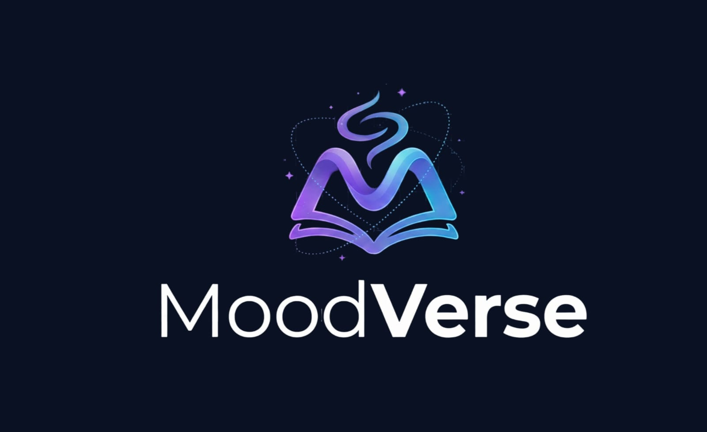

# 📚 MoodVerse — AI-Powered Mood-Based Book Discovery Platform

<p align="center">
  
</p>

<p align="center">
Discover books that match your emotions with the power of AI, semantic search, and personalized recommendations.
</p>

<p align="center">
  
  
  
  
  
  
</p>

---

# 🌐 Live Demo

### 🚀 Website

https://moodverse.onrender.com

### 🤖 ML Recommendation API

https://huggingface.co/spaces/Aakrist2511/moodverse-ml

---

# 📖 About MoodVerse

MoodVerse is an AI-powered book discovery platform that helps readers find books based on their current mood, interests, and reading preferences.

Instead of relying only on genres, MoodVerse combines mood-based exploration, semantic AI recommendations, personalized reading insights, and intelligent search to create a modern reading experience.

Whether you're feeling happy, nostalgic, adventurous, calm, or inspired, MoodVerse recommends books that match how you feel.

---

# ✨ Features

## 📚 Smart Book Discovery

- Browse books from multiple sources
- Mood-based recommendations
- Genre-based filtering
- Advanced search
- Trending books section
- Personalized discovery page

---

## 🤖 AI Reading Assistant

Powered by:

- Google Gemini
- Hugging Face Sentence Transformers

Features:

- Natural language conversations
- Mood understanding
- Semantic book recommendations
- Reading suggestions
- Intelligent recommendation engine

---

## 👤 Authentication

- Secure Signup/Login
- Session Authentication
- Protected Routes
- Persistent Login
- User Profiles

---

## ❤️ Personal Library

Users can:

- Save books
- Remove saved books
- Upload their own books
- Continue reading
- Track reading progress

---

## 📈 Personalized Recommendations

Recommendations are generated using:

- Reading history
- Saved books
- Recent searches
- AI conversations
- Favorite moods
- User uploads
- Reading activity

---

## 📖 Book Management

Users can:

- Upload books
- Upload cover images
- Manage personal library
- Edit uploaded books
- Delete uploaded books

---

## 🌍 External Integrations

Books are fetched from multiple sources including:

- Google Books API
- Open Library API
- New York Times Books API
- MoodVerse Community Library

---

## 📱 Responsive UI

Optimized for

- Desktop
- Tablet
- Mobile

Modern glassmorphism inspired UI with smooth animations.

---

# 🧠 AI Recommendation Pipeline

```text
User Query
      │
      ▼
Gemini AI
      │
Intent Classification
      │
      ▼
Semantic Search
(HuggingFace)
      │
      ▼
MongoDB Books
+
Google Books
+
Open Library
+
NYT Books
      │
      ▼
Ranked Recommendations
      │
      ▼
MoodVerse UI
```

---

# 🏗️ Tech Stack

## Frontend

- React
- React Router
- Axios
- CSS3
- React Icons
- Lucide React
- Vite

---

## Backend

- Node.js
- Express.js
- MongoDB
- Mongoose
- Express Session
- Connect Mongo
- Multer

---

## AI & Machine Learning

- Google Gemini API
- Hugging Face Spaces
- Sentence Transformers
- Semantic Similarity Search

---

## Database

- MongoDB Atlas

Collections include:

- Users
- Books
- Saved Books
- Reading Progress
- Conversations
- Queries

---

# 📂 Project Structure

```text
MoodVerse/

├── frontend/
│   ├── src/
│   │   ├── assets/
│   │   ├── components/
│   │   ├── config/
│   │   ├── pages/
│   │   ├── styles/
│   │   ├── App.jsx
│   │   └── main.jsx
│   └── package.json
│
├── chatbot/
│   ├── app.py
│   ├── recommender.py
│   └── requirements.txt
│
├── middleware/
│
├── models/
│   ├── books.js
│   ├── conversation.js
│   ├── query.js
│   ├── readingProgress.js
│   ├── savedBook.js
│   └── user.js
│
├── routes/
│   ├── authRoutes.js
│   ├── bookRoutes.js
│   ├── chatbotRoutes.js
│   ├── conversationRoutes.js
│   ├── personalizedRoutes.js
│   ├── progressRoutes.js
│   ├── queryRoutes.js
│   ├── savedBookRoutes.js
│   └── searchRoutes.js
│
├── uploads/
├── app.js
├── package.json
├── .env.example
└── README.md
```

---

# 🚀 Installation

Clone the repository

```bash
git clone https://github.com/Aakristgoyal/MoodVerse.git
```

Backend

```bash
npm install
npm start
```

Frontend

```bash
cd frontend

npm install

npm run dev
```

ML Service

```bash
cd chatbot

pip install -r requirements.txt

python app.py
```

---

# 🔐 Environment Variables

Backend

```env
PORT=

MONGO_URI=

SESSION_SECRET=

ML_API_URL=

GOOGLE_BOOKS_API_KEY=

NYT_BOOKS_API_KEY=

GEMINI_API_KEY=

FRONTEND_URL=
```

Frontend

```env
VITE_API_URL=
```

---

# 📸 Screenshots

- Home Page


- Discover Page
  


- AI Assistant
  


- Personalized Recommendations
  


- Library
  


- Upload Books
  


---

# 🌟 Future Enhancements

- Community reviews
- Reading streaks
- AI-generated summaries
- Collaborative reading lists
- Social reading profiles
- Book clubs
- Dark/Light themes
- Voice-enabled AI assistant

---

# 👨‍💻 Author

**Aakrist Goyal**

GitHub:
https://github.com/Aakristgoyal

LinkedIn:
www.linkedin.com/in/aakristgoyal

---

# ⭐ Support

If you found this project helpful, consider giving it a ⭐ on GitHub!
